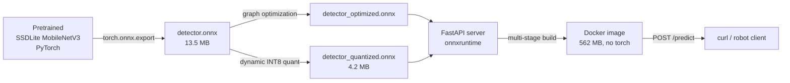

# CV Inference Pipeline — PyTorch → ONNX → Quantized → Docker

An end-to-end computer vision inference pipeline demonstrating the model-handoff
workflow that production MLOps teams care about: take a trained PyTorch detector,
optimize and quantize it for production, containerize it, and benchmark the
trade-offs honestly.

The point isn't a state-of-the-art detector — SSDLite MobileNetV3 is deliberately
modest. The point is the pipeline: ONNX export with a numerical parity check,
graph optimization, INT8 quantization, multi-stage Docker build that ships
*without* PyTorch, FastAPI service, and a real benchmark table.

---

## Architecture



The arrow that matters: `models/detector.onnx` is the handoff artifact. Everything
to the left lives in the training environment; everything to the right lives in
the deployment environment. **The runtime container has zero PyTorch.**

## Repo layout

```
.
├── src/inference/
│   ├── model.py          # load pretrained PyTorch detector
│   ├── predict.py        # PyTorch backend
│   └── predict_onnx.py   # ONNX Runtime backend (no torch import)
├── app/server.py         # FastAPI service
├── scripts/
│   ├── phase1_baseline.py    # run PyTorch model on sample images
│   ├── phase2_export_onnx.py # torch.onnx.export with dynamic axes
│   ├── phase2_parity.py      # numerical parity PyTorch vs ONNX
│   ├── phase3_optimize.py    # graph optimization + dynamic INT8 quant
│   └── phase3_benchmark.py   # latency + accuracy comparison
├── models/                # detector.onnx, _optimized.onnx, _quantized.onnx, coco_classes.json
├── data/samples/          # input images (gitignored)
├── outputs/               # bbox visualizations + benchmark JSON (gitignored)
├── Dockerfile             # multi-stage, slim, no torch
├── docker-compose.yml
├── requirements.txt           # dev: torch + everything
└── requirements-inference.txt # runtime: onnxruntime + fastapi + minimal
```

## Run it

```bash
# Dev environment
python -m venv .venv && source .venv/bin/activate
pip install -r requirements.txt

# Drop 2-3 photos with COCO classes (people, cars, animals) in data/samples/

# Phase 1: PyTorch baseline
python -m scripts.phase1_baseline

# Phase 2: ONNX export + parity check
python -m scripts.phase2_export_onnx
python -m scripts.phase2_parity

# Phase 3: optimize + quantize + benchmark
python -m scripts.phase3_optimize
python -m scripts.phase3_benchmark

# Phase 4: containerized service
docker compose up --build
curl -F "image=@data/samples/my_image.jpg" http://localhost:8000/predict
```

## Benchmark results (honest)

Model: SSDLite320 MobileNetV3-Large (COCO_V1, 5M params)
Hardware: Apple M-series, macOS 26.4, CPU only
Input: 6000×4000 JPG, internal resize to 320×320
Methodology: 3 warmup runs discarded, then 30 timed runs of forward pass only
(image decode + preprocess excluded). PyTorch `inference_mode`, ONNX Runtime
`CPUExecutionProvider`.

| Backend                  | Median   | p95      | p99      | Min      | Speedup vs PyTorch |
|---                       |---       |---       |---       |---       |---                 |
| PyTorch fp32             | 61.3 ms  | 64.3 ms  | 66.0 ms  | 59.1 ms  | 1.00x              |
| ONNX fp32 (no opt)       | 94.7 ms  | 100.2 ms | 103.6 ms | 91.9 ms  | 0.65x              |
| ONNX fp32 (graph opt)    | 95.2 ms  | 101.9 ms | 104.5 ms | 91.9 ms  | 0.64x              |
| ONNX INT8 quantized      | 100.5 ms | 105.3 ms | 106.3 ms | 99.0 ms  | 0.61x              |

Detection counts at score ≥ 0.5: PyTorch 1, ONNX fp32 (both) 1, ONNX INT8 0.

**These results are counterintuitive on purpose — they are real, and they are
the most instructive part of the project.** See "What I learned" below.

Numerical parity (ONNX fp32 vs PyTorch fp32) across 8 sample images: 8/8 passed
with max score drift 1.97e-06 and box drift 0.00 pixels.

## What I learned

**ONNX is not a magic speedup button.** On Apple Silicon CPU, PyTorch 2.5 was
~1.5× faster than ONNX Runtime on this model. PyTorch ships native arm64 kernels
backed by Apple's Accelerate framework; ONNX Runtime's `CPUExecutionProvider`
runs a generic implementation. The "ONNX is faster" claim is true on the
hardware ONNX was designed for (commodity x86 servers, NVIDIA Jetson, ARM
Cortex with quantization-aware silicon) — not on every CPU.

**Dynamic INT8 quantization can make models slower *and* less accurate.**
The INT8 model was both slower (100 ms vs 95 ms) and broke one detection.
Two reasons:
1. Dynamic quantization inserts quantize/dequantize conversion ops at layer
   boundaries. On CPUs without native INT8 acceleration, the conversion
   overhead exceeds the math savings.
2. Quantization erodes numerical precision. On a borderline detection
   (score near 0.5), the score crossed below threshold and the detection
   dropped out.

The fix would be **static quantization with calibration data** (where activations
get quantized using statistics from real images, not on-the-fly per call), or
running on hardware with proper INT8 support.

**ONNX graph optimization was a wash on this model.** Median 94.7 vs 95.2 ms,
within noise. SSDLite is already small and well-structured; the optimizer
didn't find easy fusions. Bigger transformer-family models often see more
benefit.

**The handoff format is what matters.** Even though ONNX wasn't faster on this
CPU, it is what makes the rest of the pipeline possible: the same `.onnx` file
can run on x86 servers, ARM edge devices, NVIDIA Jetson with TensorRT, or
Coral with the Edge TPU compiler. PyTorch can't say that.

**Multi-stage Docker really does matter.** The final image is 562 MB. A naïve
build with PyTorch in it would be ~2 GB. The difference is exactly the training
stack: torch, torchvision, CUDA libs, sympy, networkx — none of which the
inference container needs once the model is exported.

**TracerWarning ≠ broken.** `torch.onnx.export` produces dozens of TracerWarnings
on torchvision detection models. Most are "this Python int got baked into the
graph as a constant." The parity test is what actually tells you if it matters —
in this case, max numerical drift was 2e-06 across all sample images.

## What I would do next

- Try ONNX Runtime's `CoreMLExecutionProvider` — may flip the macOS result.
- Static (post-training) quantization with calibration on COCO val images.
- Repeat the benchmark on Linux x86 (the hardware ONNX actually targets).
- Try TensorRT on an NVIDIA Jetson — that is the deployment story this
  project is rehearsing.
- Add an `evaluate.py` that computes mAP on COCO val2017 instead of the
  qualitative detection-count comparison.

## Endpoints

| Method | Path     | Description                                      |
|---     |---       |---                                               |
| GET    | /        | Health probe — `{"status":"ok", ...}`            |
| POST   | /predict | Multipart upload, returns JSON detections        |

Example response:
```json
{
  "filename": "DSC07346.JPG",
  "n_detections": 3,
  "latency_ms": 738.2,
  "detections": [
    {"label":"person","score":0.984,"box":[3119.2,1157.2,4784.4,3964.9]},
    {"label":"horse","score":0.535,"box":[1347.9,1271.9,3089.0,3947.2]},
    {"label":"bench","score":0.500,"box":[459.1,1646.3,4285.2,3831.1]}
  ]
}
```
